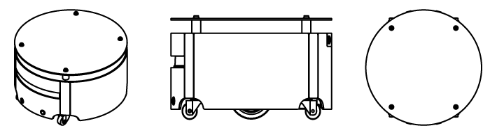

# Caster

## Overview

IQR Caster robot ROS packages.

## License
This project is licensed under the MIT License.

## caster_robot
ROS packages for the IQR Caster robot, for operating Caster robot hardware. 

 - caster_base : Hardware interface 
 - caster_control : ROS controller configuration
 - caster_description : Robot description (URDF)
 - caster_navigation : Navigation configurations and launch files

## caster_desktop
Desktop ROS packages for the IQR Caster, which may pull in graphical dependencies.

 - caster_viz : Visualization (rviz) configuration and bringup
 - caster_teleop : Joystick teleop configuration and launch file
 - caster_description : Robot description (URDF)
